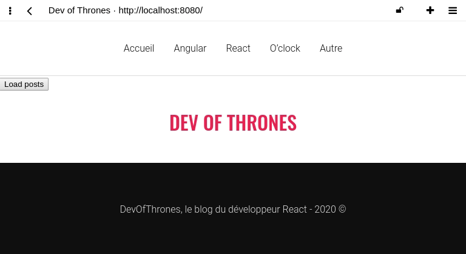

# Blog API

> Travailler sur le repo précédent du blog

## Objectif



## Instructions

Au clic sur un bouton :

- Déclencher un statut `loading` sur le blog
- Déclencher une requête `get` vers [`https://oclock-open-apis.now.sh/api/blog/posts`](https://oclock-open-apis.now.sh/api/blog/posts)
- Stocker le retour du serveur dans le state et changer le statut loading

## AJAX bonjour :wave:

Pour commencer, intaller le package [`axios`](https://github.com/axios/axios)

```
yarn add axios
```

Lire la documentation proposée ici : https://github.com/axios/axios#example

Essayer de lire le retour du serveur. Lire la réponse est déjà une super étape :muscle:

Ensuite, injecter les données dans le state de l'app.

## Bonus

Charger également les catégories depuis l'url `https://oclock-open-apis.now.sh/api/blog/categories`


## React router
yarn add react-router-dom

// librairie pour "nettoyer" le code HTML et pouvoir
yarn add dompurify


video 
3/40:56 Axios et useEffect